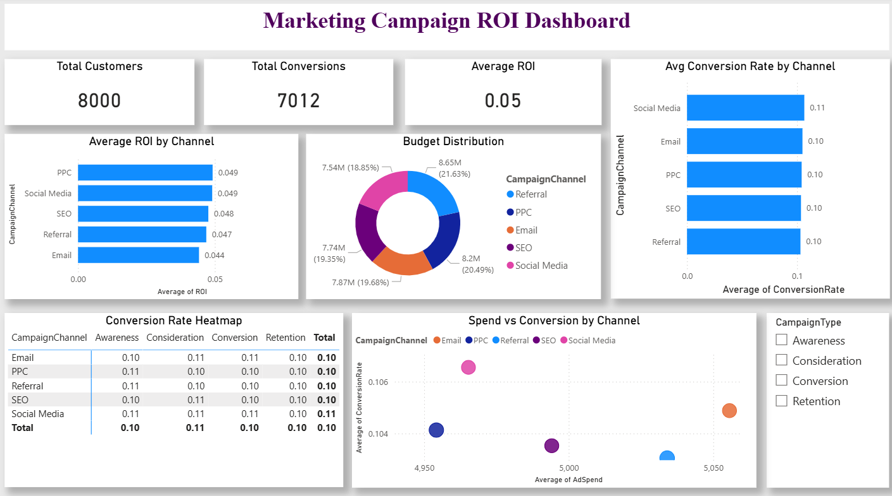

## Marketing Campaign ROI Analysis

## Project Overview
This project evaluates the performance of marketing campaigns across multiple channels using Exploratory Data Analysis (EDA). The objective is to assess ROI, conversion efficiency, and budget utilization to identify high-performing channels and provide actionable recommendations for optimizing marketing spend.

## Dataset
The dataset includes the following key variables:  
Ad Spend – Investment per campaign  
Conversions – Number of successful conversions  
Conversion Rate – Percentage of users converted  
ROI – Return on investment per campaign  
Campaign Channel – Email, Social Media, PPC, SEO, Referral  
Campaign Type – Awareness, Consideration, Conversion, Retention  

## Tools & Technologies
- Python: Pandas, Matplotlib, Seaborn  
- Jupyter Notebook for EDA  
- Power BI for interactive dashboard visualization  

## Key Insights
- PPC and Social Media campaigns deliver the highest ROI (~0.049) and conversion rates (~11%).  
- Email campaigns have the lowest ROI (~0.044), indicating scope for optimization.  
- Funnel performance is stable across stages (~10–11%) with minimal drop-offs.  
- Budget allocation (18–21% per channel) does not align with actual channel performance.  
- Increasing spend does not always lead to higher conversions, highlighting diminishing returns.  

## Recommendations
- Allocate more budget to high-performing channels like PPC and Social Media.  
- Improve Email campaign targeting and content to boost performance.  
- Reallocate funds from low-ROI channels to maximize returns.  
- Conduct A/B testing to optimize creatives and audience segments.  
- Continuously track marginal ROI to ensure cost-effective spending.  

## Dashboard & Visualizations

### Overall Dashboard

## Dashboard Demo

## Conclusion
The analysis shows that PPC and Social Media campaigns outperform others in ROI and conversions, while Email campaigns underperform relative to spend. Optimizing budget allocation and improving weaker channels will enhance overall marketing efficiency. Continuous monitoring, coupled with A/B testing, ensures strategic, data-driven decisions that maximize marketing ROI and conversions. This project demonstrates how actionable insights from data can guide marketing strategies effectively.
